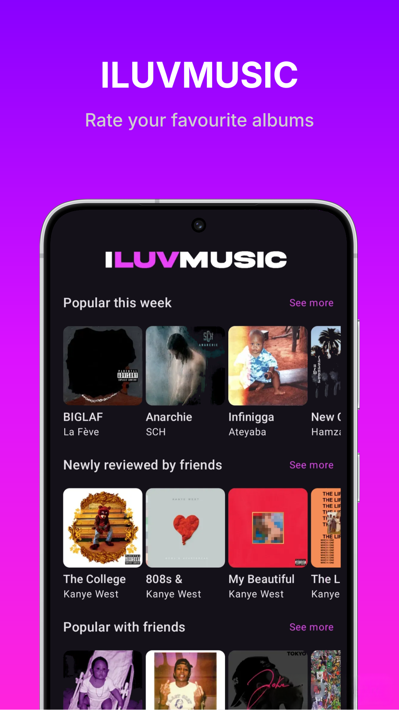
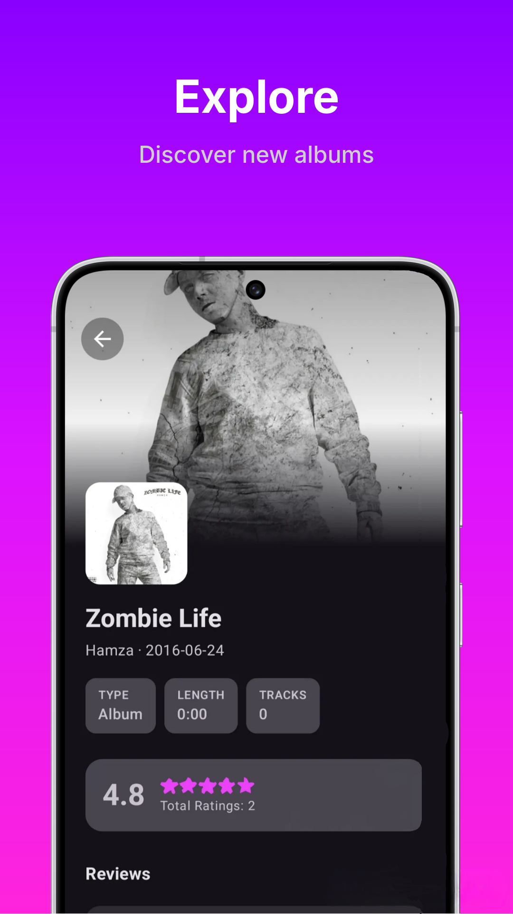
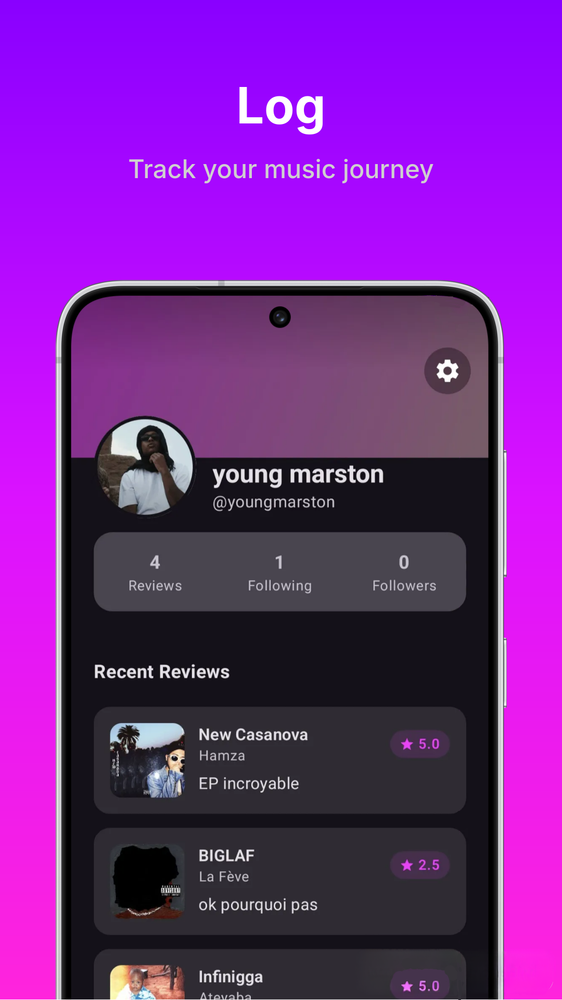
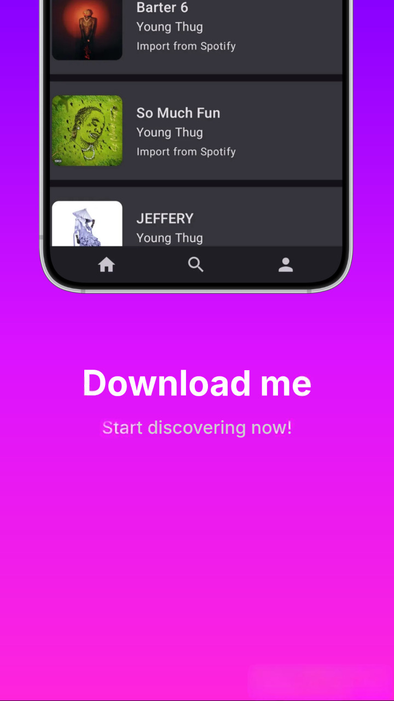

<p align="center">
   
</p>


# About this project

iLuvMusic is a Letterboxd-style app for music — log the albums you've listened to, write reviews, 
rate what you hear, and follow other users to see what they're into.

The client is built with Kotlin Multiplatform and Compose Multiplatform, targeting Android and wasmJS (experimental)
from a shared codebase. The backend is a Python Flask API that handles reviews, follows, and profile 
data, with Firebase for authentication and storage, and the Spotify API for album metadata and search.

## Features

- **Album reviews** — rate and review albums you've listened to
- **Search & browse** — find albums by search or by category
- **User profiles** — track your review count, followers, and following, with a customizable profile picture
- **Follow system** — follow other users and see their activity
- **Cross-platform client** — built once in Compose Multiplatform, runs on Android and web (wasmJS)

## Screenshots

<table>
   <tr>
      <td></td>
      <td></td>
      <td></td>
      <td></td>
   </tr>
</table>

## Future enhancements

- Profile banner images
- Lists / collections (e.g. curated or themed album lists)
- Activity feed
- Likes and comments on reviews
- Personalized recommendations
- "Friends who reviewed this" surface on album pages
- Trending albums
- Yearly listening stats / "wrapped"-style summary
- Diary/log view of reviews over time
- Push notifications

# Running iLuvMusic locally

This guide walks through getting the iLuvMusic app (Kotlin Multiplatform client + Flask backend) running on your own machine and a physical Android device.


## Prerequisites

Before you start, install:

- **Git**
- **Docker Desktop** (includes Docker Compose)
- **Android Studio** (recommended — it bundles the Android SDK and a JDK) *or*, at minimum, a JDK 17+ and the [Android command-line tools](https://developer.android.com/tools/releases/platform-tools)
- A physical Android phone with a USB cable (or on the same Wi‑Fi network as your computer)

You'll also need accounts on:
- [Spotify for Developers](https://developer.spotify.com/) (premium)
- [Firebase](https://console.firebase.google.com/) (free)

---

## Step 0 — Clone the repo

```bash
git clone <repo-url>
cd iluvmusic
```

---

## Part 1 — Server setup

1. Go to [developer.spotify.com](https://developer.spotify.com/) and create an app from your dashboard.
2. From your new app's **Settings** page, note the **Client ID** and **Client Secret**.
3. In `serverside/`, create a file named `.env`:
   ```
   SPOTIPY_CLIENT_SECRET=your_client_secret_here
   SPOTIPY_CLIENT_ID=your_client_id_here
   ```
4. Go to the [Firebase Console](https://console.firebase.google.com/) and create a new project — e.g. `iluvmusic-app-dev`. Complete the setup wizard.
5. In the Firebase Console, go to **Authentication → Sign-in method** and enable whichever provider(s) the app uses (e.g. Email/Password). Without this, login will fail even with valid credentials.
6. Go to **Project settings (gear icon) → Service accounts**, then click **Generate new private key**.
7. Download the file, rename it to `firebase-creds.dev.json`, and place it in the root of `serverside/`.
8. If you haven't already, install Docker. Then from `serverside/`, run:
   ```bash
   docker-compose up --build api-dev
   ```
9. Once it's running, note the exposed API URL and port (you'll need this for the client). By default this is your machine's port `5000`.

---

## Part 2 — Client setup

1. In the root of `iluvmusic-app/`, create a file named `local.properties`.
2. Add a line pointing to your Android SDK location:
   ```
   sdk.dir=/path/to/your/android/sdk
   ```
   If you installed Android Studio, it already has an SDK — check **Settings → Languages & Frameworks → Android SDK** for the path. If you're not using Android Studio, download the [command-line tools](https://developer.android.com/tools/releases/platform-tools) instead.
3. In the Firebase Console, go to **Project settings → General**, and click **Add app → Android**.
4. Enter the package name exactly as used by the debug build — by default `com.maniiaak.iluvmusic.dev` (the `.dev` suffix is applied automatically to debug builds).
5. Download the generated `google-services.json`. Create a folder named `debug` inside `iluvmusic-app/composeApp/src/`, and place the file there.
6. Open `iluvmusic-app/composeApp/build.gradle.kts` and find the `API_BASE_URL` field (around line 130). Point it at your machine's **local network IP** (not `localhost` — the app runs on a separate physical device) and the port from server step 9:
   ```kotlin
   buildConfigField("String", "API_BASE_URL", "\"http://192.168.1.139:5000\"")
   ```
   To find your local IP: `ipconfig` (Windows) or `ifconfig` / `ip a` (macOS/Linux). Your phone and computer must be on the **same Wi-Fi network**, and your computer's firewall must allow inbound connections on that port.

---

## Part 3 — Build and run

1. From `iluvmusic-app/`, run:
   ```bash
   ./gradlew clean
   ./gradlew :composeApp:assembleDebug
   ```
2. The APK will be at:
   ```
   iluvmusic-app/composeApp/build/outputs/apk/debug/composeApp-debug.apk
   ```
3. Transfer the APK to your Android phone (USB, cloud drive, etc.) and open it to install. Since this is a locally-built, unsigned APK rather than one from the Play Store, Android/Google Play Protect will likely warn that it's unrecognized — choose **install anyway**. Also make sure **Install unknown apps** is allowed for whichever app you used to transfer it (Settings → Apps → Special access).

---

## Troubleshooting

- **App crashes immediately on launch / stays blank:** usually means it can't reach the backend. Confirm the Docker container is still running, your phone and computer are on the same network, and `API_BASE_URL` matches your computer's current local IP (it can change between Wi-Fi sessions).
- **Home screen is empty but your profile page loads fine:** this is expected — the home feed fills up once you start reviewing albums.
- **Login fails silently:** double check you enabled a sign-in provider in Firebase Authentication (Part 1, step 5).